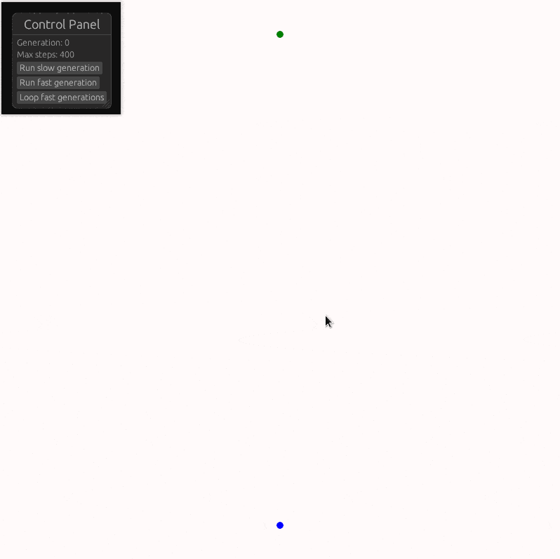

# Genetic Dots

This is taken from [Code Bullet's genetic algorithm tutorial](https://www.youtube.com/watch?v=BOZfhUcNiqk).
I ported it from Processing to Nannou as a way of learning Nannou.



## Running it

To run it you need to have Rust and Cargo installed. Just run:

```
cargo run --release
```

It's very slow if you don't use the release option.

When the program is running, press the r key on your keyboard to restart it.
